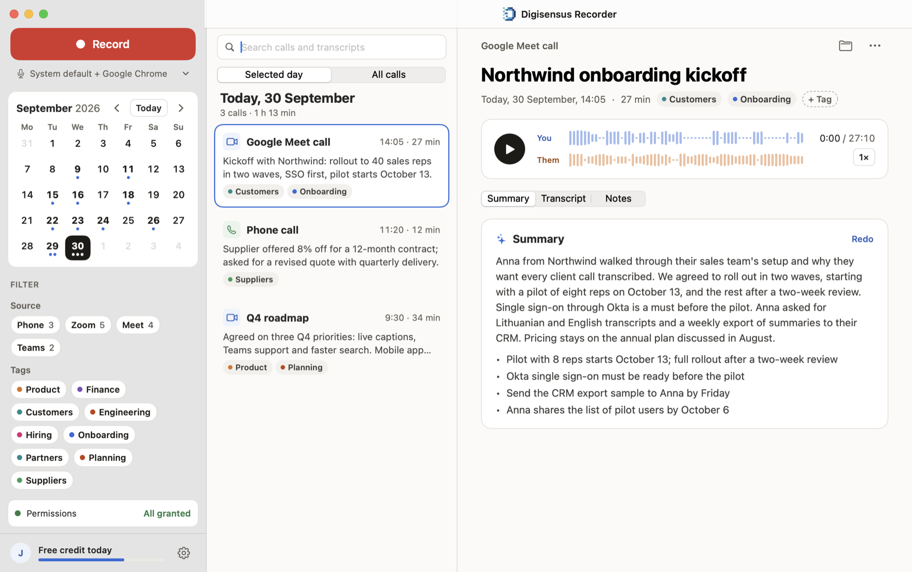
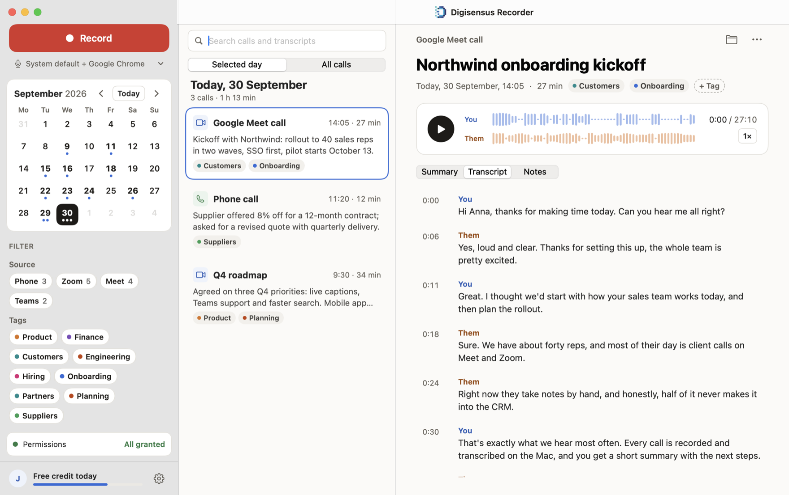
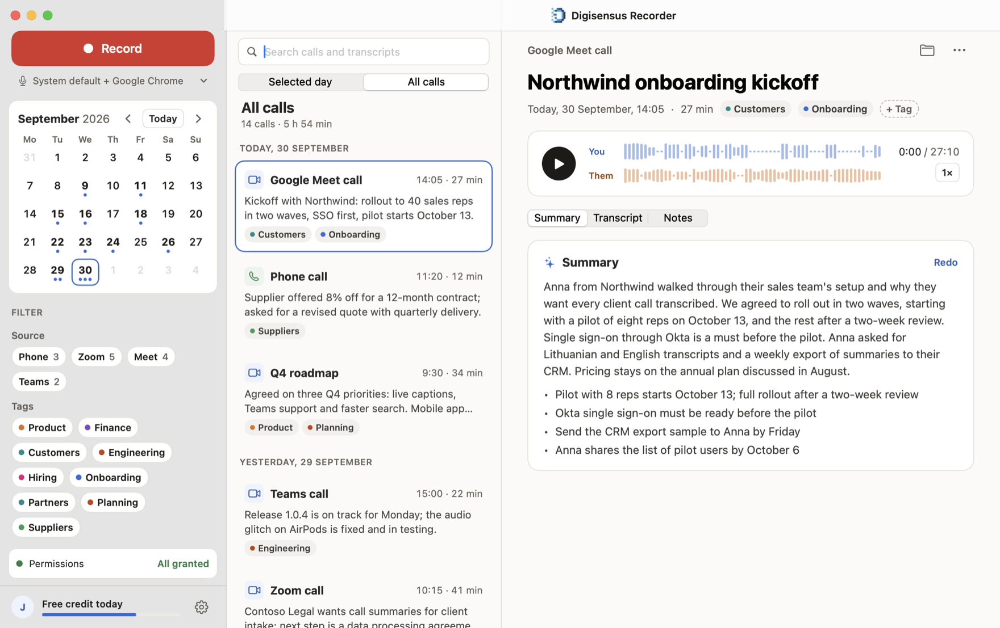
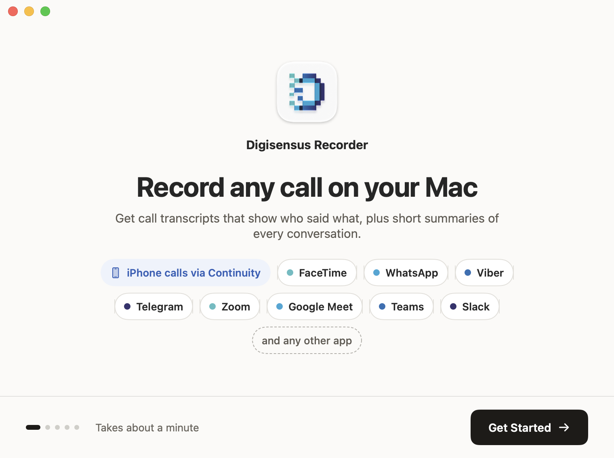
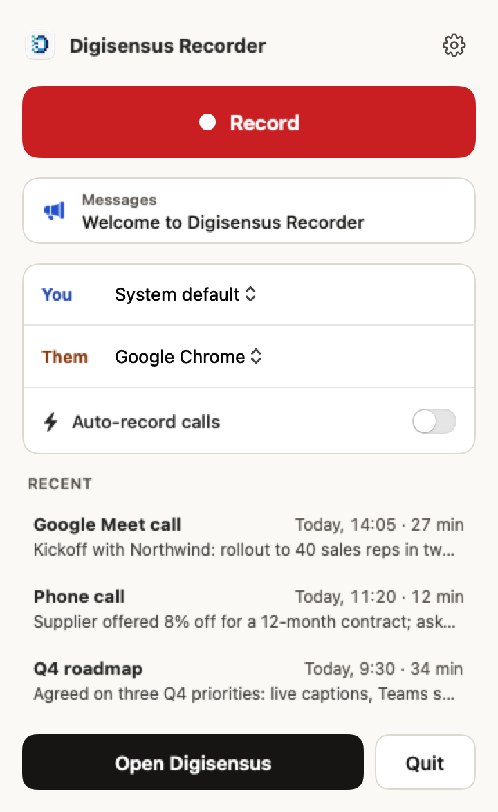

# Digisensus Recorder: free call recorder and AI meeting notes for Mac

**A free, open source call recorder and bot-free AI meeting note taker for Mac.** Record Zoom, Google Meet, Microsoft Teams, FaceTime, WhatsApp and phone calls with no bot joining the meeting, then get transcripts that show who said what and AI meeting notes with the next steps.

Recordings stay on your Mac. An open source alternative to Granola, Otter.ai and Fireflies, made by [Digisensus.com](https://digisensus.com).



<table>
  <tr>
    <td></td>
    <td></td>
  </tr>
  <tr>
    <td align="center">Transcripts that show who said what</td>
    <td align="center">Every call in one place, searchable</td>
  </tr>
</table>

<table>
  <tr>
    <td></td>
    <td align="center"></td>
  </tr>
  <tr>
    <td align="center">Works with the apps you call from</td>
    <td align="center">One click from the menu bar</td>
  </tr>
</table>

## What it does

- **Records any call.** Zoom, Google Meet, Microsoft Teams, FaceTime, WhatsApp, Viber, Telegram, Slack and any other app, plus iPhone phone calls answered on your Mac through Continuity. Your microphone and the other side are kept as separate channels, so transcripts know who said what.
- **No meeting bot.** It records the audio on your Mac, so no notetaker joins the call, nobody sees an extra participant, and it works for any call, not just scheduled meetings.
- **Starts and stops with your call.** Auto-record begins when a call starts and ends when you hang up, with a banner and a Stop button so you always know. Nothing is captured between calls.
- **Private, on your Mac.** Audio only, never the screen. Recordings are Ogg Opus files in `~/Music/Digisensus Recorder`, and nothing is uploaded unless you choose to transcribe.
- **Transcription and AI meeting notes when you want them.** Summaries list decisions and next steps, like meeting minutes written for you. Use a Digisensus account (free daily credit, sign in with your email, no password) or any OpenAI-compatible speech-to-text and chat server of your own. Or skip AI entirely.
- **Organised.** Browse by day in the calendar, filter by app or tag, and search every transcript. Each call has its own notes.
- **Works with AI agents.** The bundled `recorder` command and its MCP server let Claude Code, Codex and other agents list, search, export and summarise recordings, and start or stop recording. Turn it on in Settings › Advanced. The command lives inside the app, at `Digisensus Recorder.app/Contents/MacOS/recorder`.

```sh
recorder status | start | stop | auto on|off
recorder list --from 2026-09-01 --transcribed
recorder search "pricing"
recorder export 42 markdown
recorder mcp        # Model Context Protocol server on stdin/stdout
```

## FAQ

**How do I record calls on a Mac?**
Install Digisensus Recorder and allow the microphone and system audio permissions. With auto-record on, it records every call as it starts and stops when you hang up. You can also press Record in the menu bar at any time.

**Can it record FaceTime, WhatsApp and phone calls on a Mac?**
Yes. It records FaceTime, WhatsApp, Viber, Telegram, Zoom, Google Meet, Microsoft Teams, Slack and any other app that plays call audio on your Mac or MacBook. iPhone phone calls are recorded when you answer them on your Mac through Continuity.

**Is it a bot-free meeting recorder?**
Yes. No notetaker bot joins your Zoom, Meet or Teams call. The app records the audio on your Mac, so nobody sees an extra participant, and it also works for calls that aren't scheduled meetings.

**Is there an open source alternative to Granola, Otter.ai or Fireflies?**
Digisensus Recorder is free and open source under the GPL. Like them, it gives you transcripts and AI meeting notes. It also records any call, not just meetings, keeps the recordings on your Mac, and lets you use your own transcription server.

**Where are my recordings stored?**
On your Mac, as Ogg Opus audio files in `~/Music/Digisensus Recorder`. Nothing is uploaded unless you ask for a transcript. Transcription runs on the Digisensus service or on an OpenAI-compatible server you choose, which can be one running on your own Mac.

**Is it free?**
Yes. Recording is free with no account. Transcripts and summaries through a Digisensus account come with free daily credit, or you can use your own AI service instead.

**Is it legal to record calls?**
Recording laws differ between countries and states. Telling others that the call is being recorded, and getting their consent where required, is up to you.

## Build from source

Requires macOS 15 Sequoia or later and the Swift 6 toolchain (Xcode or the command-line tools).

```sh
swift build            # debug build
swift test             # database, Ogg Opus and summary parsing tests
./build.sh             # builds "Digisensus Recorder.app" into ./build
```

With the Command Line Tools alone (no Xcode), `swift test` needs to be told where the Swift Testing macros are:

```sh
swift test --disable-xctest -Xswiftc -plugin-path -Xswiftc /Library/Developer/CommandLineTools/usr/lib/swift/host/plugins/testing
```

`build.sh` signs with your first Developer ID identity (or `CODESIGN_ID`), falling back to ad-hoc signing, which makes macOS ask for the microphone and system audio permissions again after every build. libopus and libogg come prebuilt in `Vendor/lib`; see [Vendor/README.md](Vendor/README.md) for how they were built.

### Development hooks

Environment variables the app reads, for working on it without a real call or a real server:

| Variable | Effect |
| --- | --- |
| `DIGISENSUS_SERVER` | Use this Digisensus backend (e.g. `http://localhost:8085`) for accounts, transcription, messages and updates. |
| `DSREC_ONBOARDING` | Show the first-launch walkthrough again. |
| `DSREC_SNAPSHOT=<folder>` | Render the walkthrough, main window, Settings and menu bar panel to PNGs in that folder, then quit. |
| `DSREC_DEMO` | Report notifications as allowed, for screenshots from a test bundle. |
| `DSREC_DETECT_PROCESS=<name>` | Treat that process holding the microphone as a call, so auto-record can be tested without one. |
| `DSREC_TAP_PROCESSES=<a,b>` | Tap these processes for the "Phone & FaceTime calls" source instead of the call daemons. |
| `DSREC_MESSAGES_POLL=<seconds>` | Check for messages this often (at least 5) instead of every 15 minutes. |
| `DSREC_UPDATE_QUIET=<seconds>` | How long the app must be idle before a downloaded update installs itself (default 10 minutes). |

The app logs to `~/Library/Logs/Digisensus Recorder.log` (Settings › Advanced › Show Log).

## License

Digisensus Recorder is licensed under the [GNU General Public License version 3](LICENSE), with additional terms under section 7 set out in [NOTICE](NOTICE). In short: you may use, study, change and share it, and works based on it stay open source under the same terms. They must keep the attribution "Based on Digisensus Recorder by Digisensus.com", with a link to https://digisensus.com, in their legal notices (in this app, Settings › License). They must also not present themselves as the official app or use the Digisensus name and logos as their own branding.

It is built on these open source projects, whose licenses are in [Resources/Licenses](Resources/Licenses):

| Project | Used for | License |
| --- | --- | --- |
| [Opus](https://opus-codec.org) (libopus) | Audio compression | BSD 3-Clause |
| [libogg](https://xiph.org/ogg/) | Ogg file format | BSD 3-Clause |
| [GRDB.swift](https://github.com/groue/GRDB.swift) | Recording library, transcripts and search | MIT |
| [Sparkle](https://sparkle-project.org) | Updates (not in the App Store build) | MIT |
